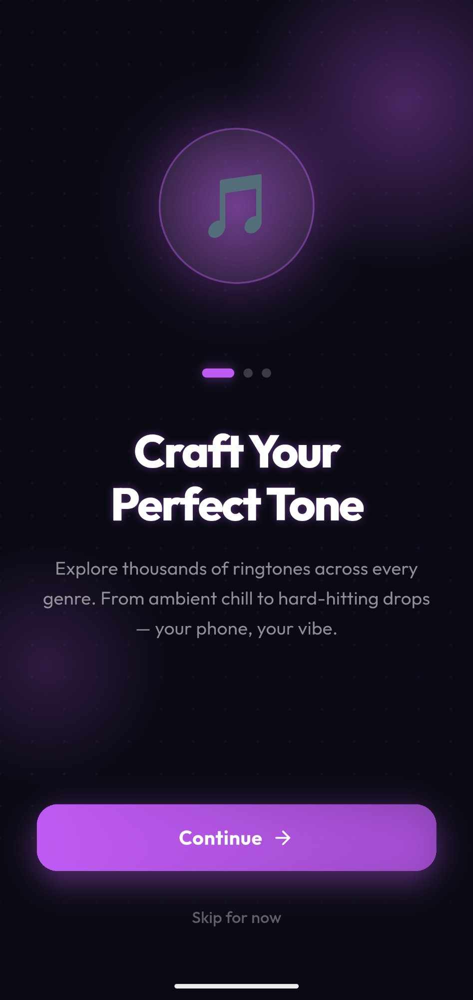
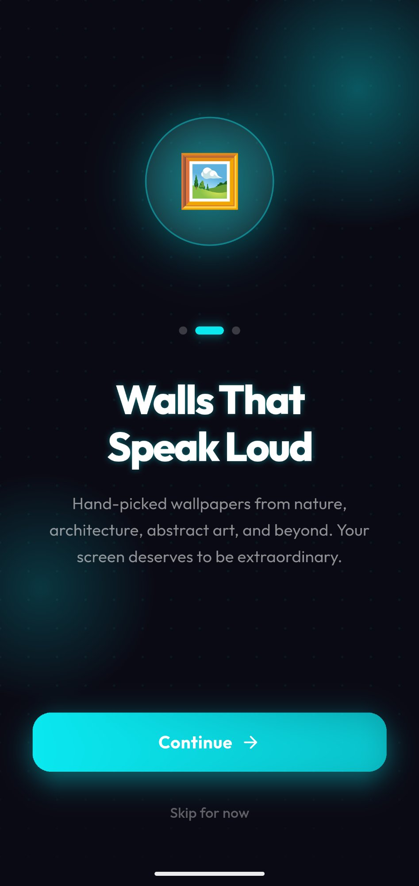
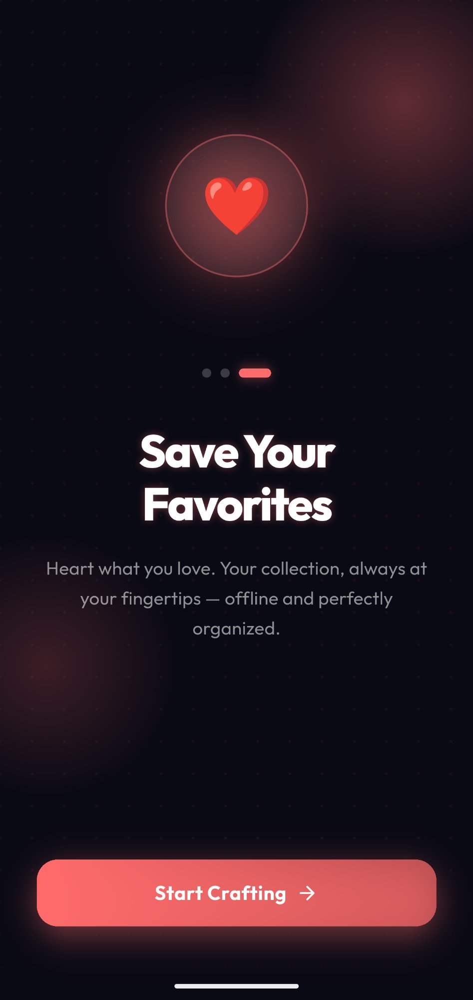
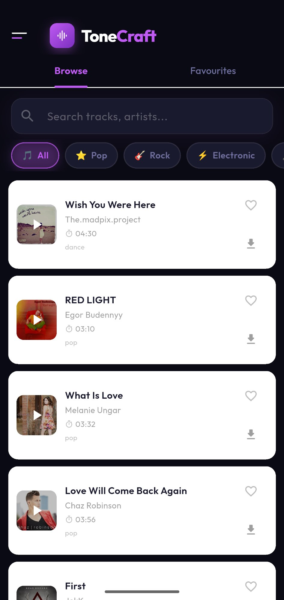
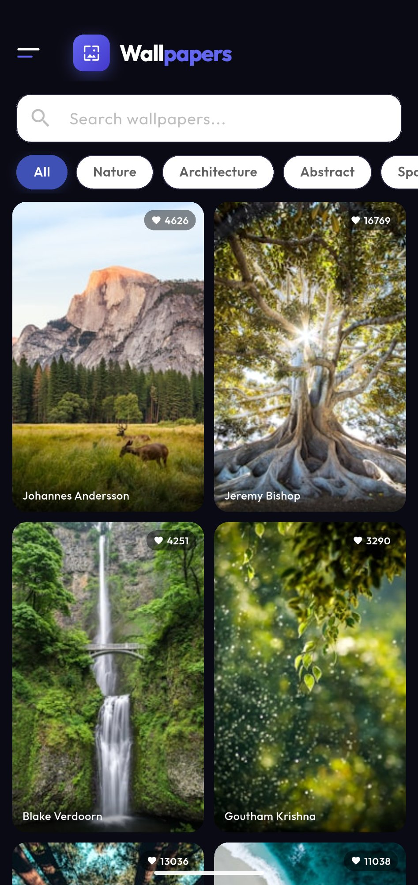

# 🎵 ToneCraft

> **Discover, preview, and set stunning ringtones & wallpapers — all in one place.**

ToneCraft is a beautifully designed Flutter application that lets users explore thousands of ringtones and high-quality wallpapers, preview them in real time, save their favorites, and apply them directly to their device. Built with a sleek dark UI and smooth animations, ToneCraft delivers a premium experience from first launch.

---

## 📸 Screenshots

<table>
  <tr>
    <td align="center"><b>Onboarding — Ringtones</b></td>
    <td align="center"><b>Onboarding — Wallpapers</b></td>
    <td align="center"><b>Onboarding — Favorites</b></td>
  </tr>
  <tr>
    <td></td>
    <td></td>
    <td></td>
  </tr>
  <tr>
    <td align="center"><b>Ringtones — Browse</b></td>
    <td align="center"><b>Wallpapers — Browse</b></td>
    <td></td>
  </tr>
  <tr>
    <td></td>
    <td></td>
    <td></td>
  </tr>
</table>

---

## ✨ Features

### 🎶 Ringtones
- **Browse & Search** — Explore thousands of tracks powered by the Jamendo API, searchable by keyword or filtered by genre.
- **Genre Categories** — Quick-filter chips for Pop ⭐, Rock 🎸, Electronic ⚡, Hip-Hop 🎤, Jazz 🎷, Classical 🎻, Ambient 🌙, Acoustic 🎼, Metal 🤘, R&B 💜, and more.
- **Live Audio Preview** — Tap any ringtone card to preview it with a full-screen audio player sheet, waveform visualizer, and seek bar.
- **Download** — Download ringtones as `.mp3` files to device storage with a real-time progress indicator.
- **Set as Ringtone** — Set any downloaded track as the system ringtone directly from the app via a native Android `MethodChannel`.
- **Favorites** — Heart any ringtone to save it locally. Your collection persists across sessions using `SharedPreferences`.
- **Infinite Scroll** — Automatically loads more tracks as you scroll down.
- **Shimmer Loading** — Elegant skeleton placeholders while content loads.

### 🖼️ Wallpapers
- **Browse & Search** — Discover stunning photos powered by the Unsplash API, searchable by keyword or filtered by category chips.
- **Category Chips** — Nature, Architecture, Abstract, Space, City, Mountains, Ocean, Dark, Minimal, Cars, Animals — with an "All" tab that merges 20 images from every category.
- **Full-Screen Preview** — Tap any wallpaper for an immersive full-screen view with photographer credit and resolution badge.
- **Download to Gallery** — Save wallpapers to `Pictures/ToneCraft` in your device gallery using `MediaStore` (compatible with Android 10+ and below).
- **Set as Wallpaper** — Apply wallpaper to Home Screen, Lock Screen, or both, powered by a native `WallpaperManager` integration.
- **Color Placeholder** — Each card shows the wallpaper's dominant color while the image loads for a smooth, no-flash experience.

### 🚀 App Experience
- **Onboarding Screen** — A beautiful 3-page animated onboarding flow shown on first launch (pulse, float, and fade animations).
- **Side Drawer Navigation** — Slide-out drawer for seamless switching between Ringtones and Wallpapers screens.
- **Dark Theme** — Deep space dark UI (`#0A0A14`) with violet (`#BF5AF2`) and cyan (`#0AE8F0`) accents throughout.
- **Custom Font** — Outfit typeface (Regular → ExtraBold) for a modern, polished look.
- **Portrait Lock** — App is locked to portrait orientation for a consistent experience.

---

## 🛠️ Tech Stack

| Layer | Technology |
|---|---|
| Framework | Flutter 3.x (Dart ≥ 3.0) |
| Ringtone API | [Jamendo API v3](https://developer.jamendo.com/v3.0) |
| Wallpaper API | [Unsplash API](https://unsplash.com/developers) |
| Audio Playback | `audioplayers ^6.0.0` |
| Image Loading | `cached_network_image ^3.3.1` |
| HTTP Client | `http ^1.2.1` |
| Permissions | `permission_handler ^11.3.1` |
| Local Storage | `shared_preferences ^2.2.3` |
| File Paths | `path_provider ^2.1.3` |
| Shimmer UI | `shimmer ^3.0.0` |
| Native Channels | Kotlin `MethodChannel` (ringtone + wallpaper) |

---

## 📦 Installation

### Prerequisites
- Flutter SDK `>=3.0.0`
- Android Studio or VS Code with Flutter plugin
- A physical Android device or emulator (API 21+)

### Steps

**1. Clone the repository**
```bash
git clone https://github.com/your-username/tonecraft.git
cd tonecraft
```

**2. Install dependencies**
```bash
flutter pub get
```

**3. Add your API keys**

Open `lib/services/ringtone_api_services.dart` and replace:
```dart
static const String _clientId = 'YOUR_JAMENDO_CLIENT_ID';
```

Open `lib/services/wallpapers_api_services.dart` and replace:
```dart
static const String _accessKey = 'YOUR_UNSPLASH_ACCESS_KEY';
```

> Get a free Jamendo key at [developer.jamendo.com](https://developer.jamendo.com)
> Get a free Unsplash key at [unsplash.com/developers](https://unsplash.com/developers)

**4. Run the app**
```bash
flutter run
```

---

## 🔐 Android Permissions

The following permissions are declared in `AndroidManifest.xml`:

```xml
<!-- Internet access for API calls -->
<uses-permission android:name="android.permission.INTERNET"/>

<!-- Storage — legacy Android ≤ 12 -->
<uses-permission android:name="android.permission.READ_EXTERNAL_STORAGE" android:maxSdkVersion="32"/>
<uses-permission android:name="android.permission.WRITE_EXTERNAL_STORAGE" android:maxSdkVersion="29"/>

<!-- Granular media permissions — Android 13+ -->
<uses-permission android:name="android.permission.READ_MEDIA_IMAGES"/>
<uses-permission android:name="android.permission.READ_MEDIA_AUDIO"/>

<!-- Save to gallery -->
<uses-permission android:name="android.permission.MANAGE_MEDIA"/>

<!-- Required to set system ringtone -->
<uses-permission android:name="android.permission.WRITE_SETTINGS"/>
```

> On Android 6+ the app will open the **Modify System Settings** screen automatically if `WRITE_SETTINGS` has not been granted.

---

## 🏗️ Project Structure

```
lib/
├── main.dart                        # App entry point, theme, onboarding check
├── screens/
│   ├── home_screen.dart             # Ringtones browse, search, favorites tabs
│   ├── wallpaper_screen.dart        # Wallpapers browse, search, preview
│   └── onboarding_screen.dart       # Animated 3-page onboarding flow
├── widgets/
│   ├── ringtone_card.dart           # Ringtone list card with play/download/set
│   └── audioplayer_sheet.dart       # Full-screen audio player bottom sheet
├── services/
│   ├── ringtone_api_services.dart   # Jamendo API integration
│   ├── wallpapers_api_services.dart # Unsplash API integration
│   ├── download_services.dart       # File download + set ringtone (native)
│   ├── audio_services.dart          # AudioPlayer singleton wrapper
│   └── favourites_service.dart      # SharedPreferences favorites CRUD
└── model/
    ├── ringtone_model.dart          # Ringtone data model + JSON parsing
    └── wallpaper_model.dart         # Wallpaper data model + JSON parsing

android/
└── app/src/main/kotlin/com/example/tonecraft/
    └── MainActivity.kt              # MethodChannels: setRingtone + setWallpaper
```

---

## 🔧 Native MethodChannels

ToneCraft uses two Kotlin `MethodChannel` implementations in `MainActivity.kt`:

### `com.ringle.app/set_ringtone`
| Method | Description |
|---|---|
| `getSdkInt` | Returns the device's Android SDK version |
| `setRingtone` | Inserts the MP3 into `MediaStore` and sets it as the default ringtone |

### `com.tonecraft/wallpaper`
| Method | Description |
|---|---|
| `saveToGallery` | Saves image to `Pictures/ToneCraft` using `MediaStore` (Android 10+) |
| `setWallpaper` | Applies image as Home Screen, Lock Screen, or both via `WallpaperManager` |

---

## 📋 Dependencies

```yaml
dependencies:
  flutter:
    sdk: flutter
  http: ^1.2.1
  audioplayers: ^6.0.0
  path_provider: ^2.1.3
  permission_handler: ^11.3.1
  shared_preferences: ^2.2.3
  cached_network_image: ^3.3.1
  shimmer: ^3.0.0
  cupertino_icons: ^1.0.6
```

---

## 🤝 Contributing

Contributions, issues, and feature requests are welcome!

1. Fork the repository
2. Create your feature branch: `git checkout -b feature/amazing-feature`
3. Commit your changes: `git commit -m 'Add amazing feature'`
4. Push to the branch: `git push origin feature/amazing-feature`
5. Open a Pull Request

---

## 📄 License

This project is licensed under the MIT License.

```
MIT License

Copyright (c) 2025 Muhammad Atif Javeid

Permission is hereby granted, free of charge, to any person obtaining a copy
of this software and associated documentation files (the "Software"), to deal
in the Software without restriction, including without limitation the rights
to use, copy, modify, merge, publish, distribute, sublicense, and/or sell
copies of the Software, and to permit persons to whom the Software is
furnished to do so, subject to the following conditions:

The above copyright notice and this permission notice shall be included in all
copies or substantial portions of the Software.

THE SOFTWARE IS PROVIDED "AS IS", WITHOUT WARRANTY OF ANY KIND, EXPRESS OR
IMPLIED, INCLUDING BUT NOT LIMITED TO THE WARRANTIES OF MERCHANTABILITY,
FITNESS FOR A PARTICULAR PURPOSE AND NONINFRINGEMENT. IN NO EVENT SHALL THE
AUTHORS OR COPYRIGHT HOLDERS BE LIABLE FOR ANY CLAIM, DAMAGES OR OTHER
LIABILITY, WHETHER IN AN ACTION OF CONTRACT, TORT OR OTHERWISE, ARISING FROM,
OUT OF OR IN CONNECTION WITH THE SOFTWARE OR THE USE OR OTHER DEALINGS IN THE
SOFTWARE.
```

---

## 👨‍💻 Author

**Muhammad Atif Javeid**

> *Built with ❤️ using Flutter*
